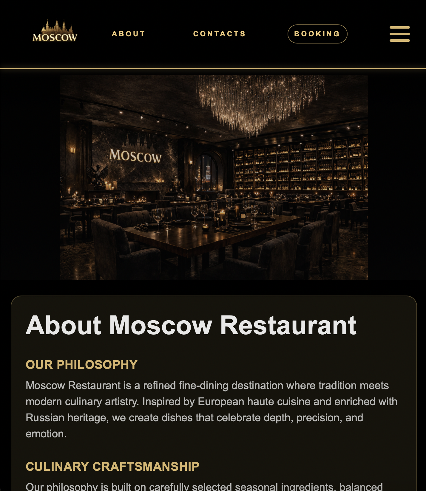
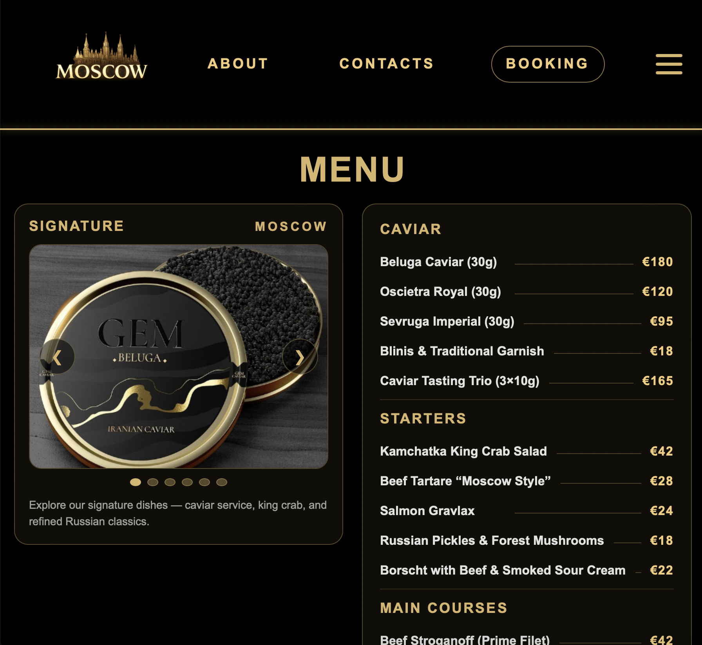
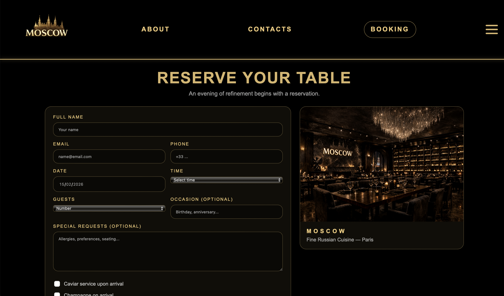
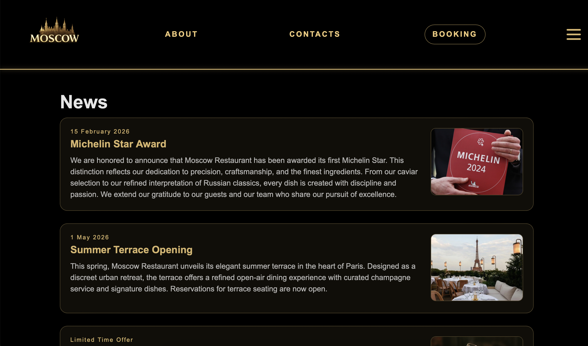

# Moscow Restaurant Website

A modern multi-page restaurant website built with Flask and Jinja templating engine.  
The project demonstrates backend-driven template architecture combined with structured frontend layout and responsive UI design.

---

## 🖼 Project Preview

### Homepage


### Menu Page


### Booking Page


### News Section


---

## About the Project

This project was developed as part of a university Web Module with a focus on building a structured, scalable web application using Flask.

The goal was not just to create static HTML pages, but to implement:

- Template inheritance using Jinja
- Clear separation between backend logic and frontend presentation
- Reusable layout components
- Structured routing architecture
- Organized static asset management

The website includes multiple interconnected pages and demonstrates how backend templating improves scalability and maintainability compared to pure static HTML.

---

## 🏗 Architecture Overview

The application follows a modular and clean structure:

restaurant_site/
│
├── app.py # Flask application entry point
├── templates/ # Jinja template files
│ ├── base.html # Core reusable layout
│ ├── index.html # Homepage
│ ├── menu.html
│ ├── booking.html
│ ├── news.html
│ └── rules.html
│
├── static/
│ ├── style.css # Custom styling
│ ├── js/main.js # Client-side scripts
│ └── img/ # Image assets
│
└── .gitignore

---


### Key Architectural Concepts

- Template inheritance (`base.html`)
- Component reuse across pages
- Structured Flask routing
- Separation of concerns (logic vs presentation)
- Organized static file handling

---

## ✨ Core Features

- Responsive multi-page layout
- Custom UI design
- Structured restaurant menu presentation
- Booking interface page
- News & content section
- Clean project hierarchy
- Scalable structure ready for backend expansion

---

## 🛠 Tech Stack

- Python 3
- Flask
- Jinja2
- HTML5
- CSS3
- JavaScript

--

## Running Locally

### 1️⃣ Clone the repository

```bash
git clone https://github.com/SemenShchelkonogov/University-Project-Web-Module-Restaurant-Website.git
cd University-Project-Web-Module-Restaurant-Website

2️⃣ Create virtual environment
python -m venv .venv
source .venv/bin/activate

3️⃣ Install dependencies
pip install flask

4️⃣ Run the application
python app.py

5️⃣ Open in browser
http://127.0.0.1:5000


